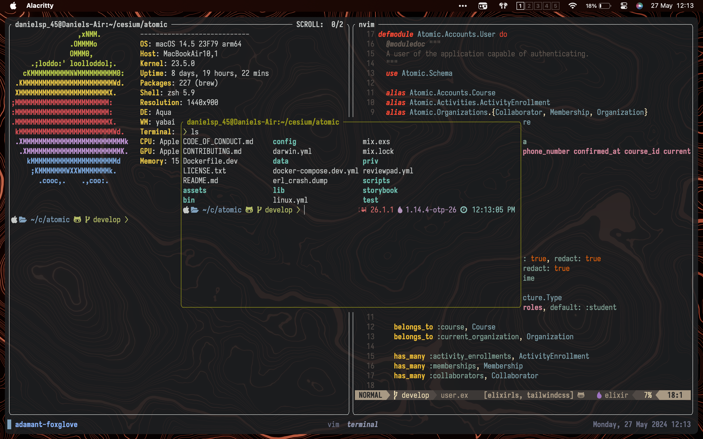

  

Hey there! This repo is a collection of cofigurations and scripts of my daily development tools. I use macOS as my daily driver so the configs are optimized for that although most of the tools and configurations are cross-platform.

Feel free to use them as reference or copy them at your own risk (_I'm not responsible for any damage that may be caused by them_, see [LICENSE](LICENSE.txt)).
If you have any questions or suggestions, feel free to open an issue or a pull request.

## :memo: License

This repository is licensed under the [WTFNMFPL](LICENSE.txt).

  Use your tools well or use better tools.

